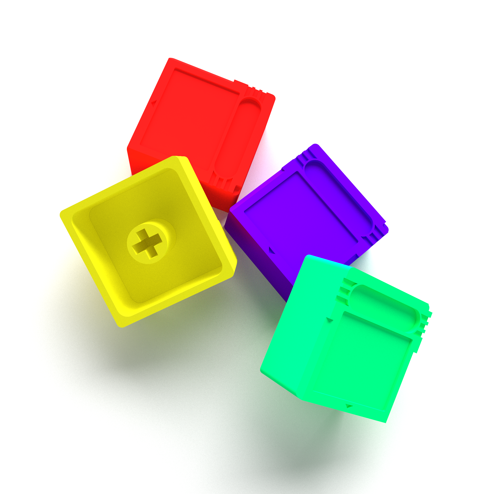

Project file is for FreeCAD. I am unable to advise on print settings at the moment, as I'm still working on printing out a prototype myself. I wanted to get the source out early, so you might need to tweak the model in FreeCAD to suit your needs better.

14mm\*10.5mm is the size of the front sticker (which should fit comfortably within the indentation). I'm personally going to use vinyl sticker paper and an inkjet printer. I reccomend using a cutting machine if you have one, although a craft knife will do. Sealing the sticker with some sort of clear coat is advisable, as this will need to withstand repeated use.

> I created this in the interest of making a cool idea available to everyone. If I complicated licensing with something as simple as a keycap, I would be defeating the core motivation behind its creation. This is how I view true success in my work: simplicity and usefulness. I wish to produce more in the future with these two goals at the forefront, and I hope this little keycap stands as a tiny little 18.1-millimeter tall monument to the open-source creation of goods and the sharing of ideas.
