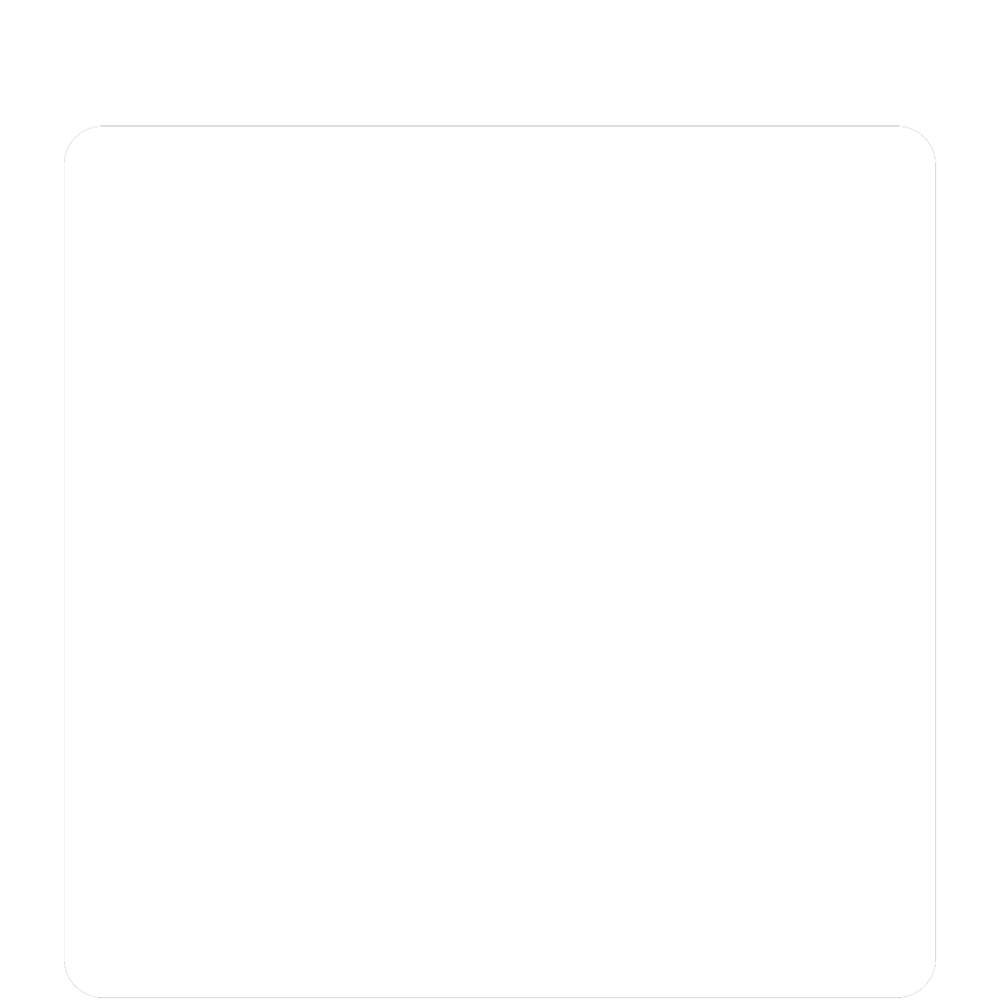

This keycap design mimics the original Game Boy's cartridge design, and was directly inspired by [u/BlueBomberFox](https://www.reddit.com/user/bluebomberfox). The design closely follows that of a R1 cherry profile keycap, and should have no problems fitting on any MX-style switch. 

Cartridge Keycap V2 is a complete remodel of the Cartridge Keycap design in FreeCad 0.20. This version utilizes more sensible constraints and modeling practices while maintaining the same tree order as the original. It is, dimension for dimension, identical to the original project file.

Everything present in this folder is distrubuted by EuphoricPenguin under the [CC-0 1.0](https://creativecommons.org/publicdomain/zero/1.0/) license.

This keycap was created with multiple manufacturing methods in mind. Experimentation may be necessary to get the best results. If tolerances become an issue, changes to the project file may be needed.

Should you add a front sticker to the keycap, 14mm*10.5mm is the recommended size. The sticker may need some form of lamination if the keycap is to be subject to repeated use.